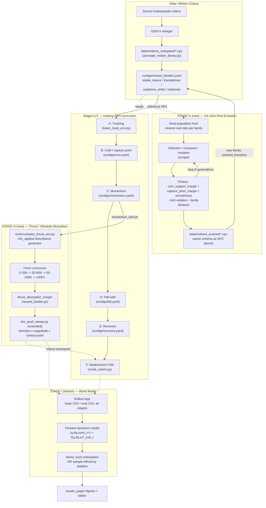
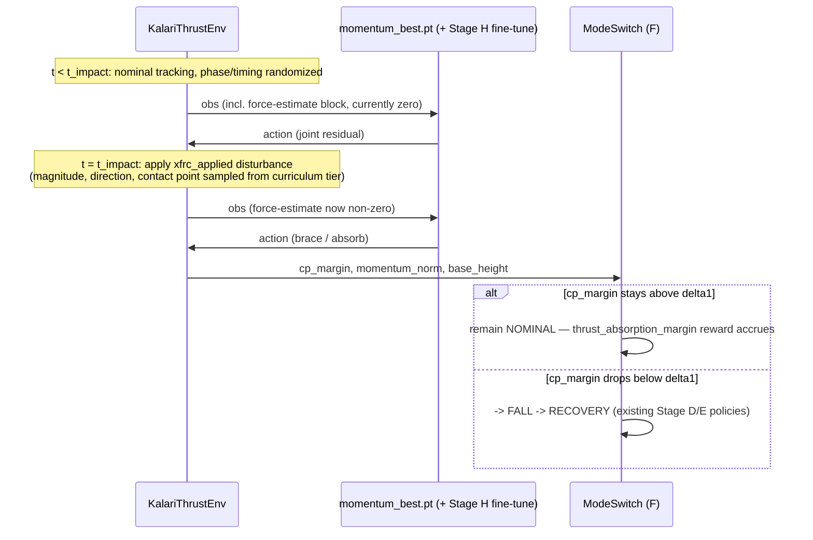
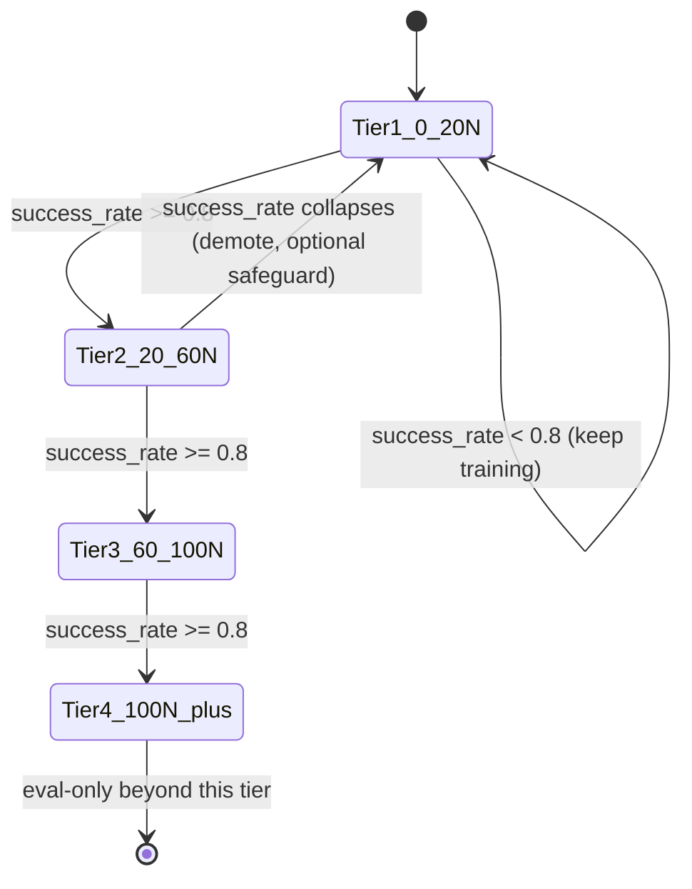
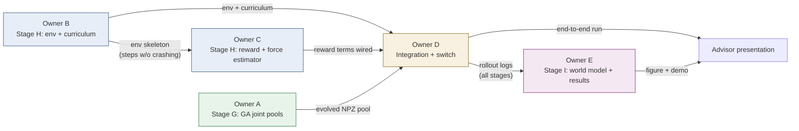
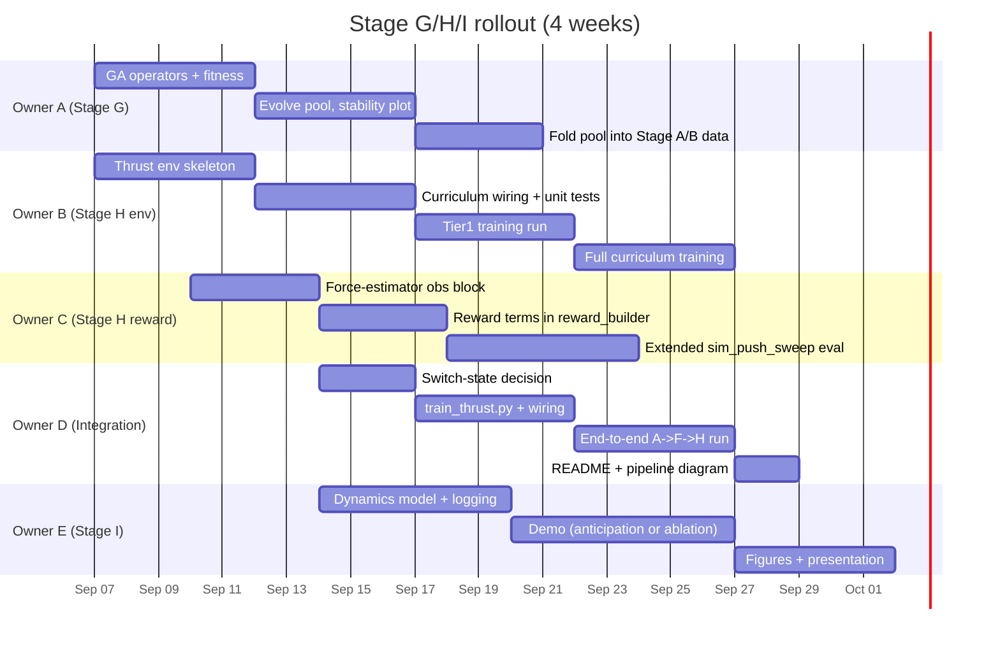

# Physical AI Draft: Stage G (GA Joint Pools), Stage H (Thrust/Obstacle Absorption), Stage I (World Model)

Status: DRAFT for team review. Grounded in the current repo (Stages A-F already
implemented) — not a rewrite, an extension. Team size: 5.

## 1. What already exists (recap, so new work doesn't duplicate it)

| Stage | Script / files | What it does |
|---|---|---|
| A — Tracking | `scripts/train_tracking.py`, `src/envs/kalari_track_env.py` | PPO residual tracking on one reference motion. Obs 124-dim (q, dq, gravity_b, angvel_b, ref[t], ref[t+1], phase). Action = joint residual, `q_cmd = q_ref + 0.25*a`, PD @ 500Hz. |
| B — CoM | `scripts/train_com.py`, `configs/com.yaml` | Loads `tracking_best.pt`, adds `com_support` obs, `com_support_margin` + `capture_point_margin` rewards, oversamples `single_support`/`stable_stance` families. |
| C — Momentum | `scripts/train_momentum.py`, `configs/momentum.yaml` | Loads `com_best.pt`, adds `momentum` obs, `momentum_magnitude` + `momentum_phase_weighted` rewards, phase-weights `rotational`/`explosive_strike` families. |
| D — Fall-safe | `scripts/train_fall.py`, `configs/fall.yaml` | Loads `momentum_best.pt`, trains from near-fall states (`cp_margin < delta1`), `impact_penalty` (head 5x, torso 2x) + `head_hit_penalty`. |
| E — Recovery | `scripts/train_recovery.py`, `configs/recovery.yaml` | Trains from randomized fallen states, `recovery_success` bonus + `time_to_upright` penalty. |
| F — Switch | `scripts/train_switch.py`, `src/switch/mode_switch.py`, `configs/switch.yaml` | Threshold FSM (NOMINAL/FALL/RECOVERY) on `cp_margin`, `momentum_norm`, `base_height`, with hysteresis (`min_dwell_steps`). |
| Eval prototype | `scripts/sim_push_sweep.py` ("Stage 3A") | Lateral pelvis push via `xfrc_applied`, forces 0-100N, from horse stance. Logs CP-margin trace, switch events, fall/no-fall. **This is the seed of Stage H below — currently an eval sweep, not a training curriculum.** |
| CoM/momentum source of truth | `src/dynamics/pinocchio_wrapper.py` | All CoM, capture-point, support-polygon, centroidal-momentum math. Every new reward reuses this, never reimplements it. |
| Motion corpus | `configs/motion_families.yaml` | ~70 Kalaripayattu clips tagged `stable_stance` / `translational` / `explosive_strike` / `rotational`. Drives curriculum oversampling. |

### 1.1 Full pipeline, current + proposed (data flow)



Read this as: **G feeds data into A/B** (more/better reference motions), **H
branches off C** and produces a robustness-tested checkpoint that F's switch (or
an augmented NOMINAL policy) consumes, and **I sits on top, consuming logs from
everything** to produce the one research figure for the presentation.

Gaps this draft addresses:
1. Pose interpolation is 100% data-driven (GEM-X retarget only) — nothing synthesizes
   plausible transitions between clips/families. → **Stage G**.
2. Force absorption exists only as a post-hoc eval sweep on top of already-trained
   policies, not a curriculum with its own reward shaping and disturbance schedule,
   and only tests one push type (lateral, pelvis, static stance). → **Stage H**.
3. Everything is model-free PPO. No predictive/world model component — this is the
   piece that makes the project read as research rather than an engineering pipeline
   for an advisor presentation. → **Stage I**.

## 2. Stage G — Genetic Algorithm Joint-Pool Evolution

**Problem it solves:** filling gaps between reference clips (e.g. no captured
transition from `ky_warrior_lunge` to `pk_kick_lunge`) with physically plausible,
stable joint-angle trajectories — cheaply, without spinning up MuJoCo/PPO for what
is fundamentally a static trajectory-optimization search, not a sequential
decision problem.

**Why GA and not RL here:** low-dimensional keyframe search space, cheap
kinematics-only fitness (no contact sim needed), no exploration-under-uncertainty
element. RL stays reserved for the actual control problem (Stages A/B/C/H).

**Representation:** chromosome = 5-7 keyframes x 29 DOF joint angles, spline-
interpolated (Catmull-Rom) to full frame rate. Seed the initial population from
the nearest real clips in the same `motion_families.yaml` family, not random
noise — keeps the search local and "Kalari-looking".

**Fitness (reuses existing reward primitives, no new physics code):**
- stability: `com_support_margin` + `capture_point_margin` (same functions Stage B
  already calls in `pinocchio_wrapper.py`, same `delta` convention as `configs/com.yaml`)
- smoothness: `-sum(second_derivative(q))^2` (jerk minimization)
- limit violation: hard death if any `q` outside `jnt_lo`/`jnt_hi` (same bounds
  `kalari_track_env.py` already reads from the MJCF `jnt_range`)
- family coherence: `-mean_sq_dist` to nearest real clip in the target family
  (prevents "stable but generic" solutions that don't look like Kalaripayattu)

**GA operators:** tournament selection, blend crossover on keyframes, Gaussian
mutation with per-joint sigma scaled to that joint's ROM, elitism (keep best N).
Population ~100-300, generations ~50-200 — should run in minutes on CPU, no GPU
needed.

**Output contract:** write evolved trajectories as NPZ files matching the exact
schema `scripts/annotate_motion_library.py` already produces (`joint_cols`,
`joint_pos`, `root_pos`, `root_quat_xyzw`, `fps`, `motion_id`) into
`data/motions_evolved/`, tagged with a new family (`evolved_transition`) in
`motion_families.yaml`. **Zero changes needed to `kalari_track_env.py` or Stage A/B
training** — the evolved clips just become more rows in the existing motion
library.

**New files:** `src/ga/` (population, operators, fitness), `scripts/evolve_joint_pool.py`,
optionally `configs/ga_joint_pool.yaml` for population size / generations / mutation
rates.

### 2.1 Algorithm (per transition pair, e.g. `ky_warrior_lunge -> pk_kick_lunge`)

```
1. Load both endpoint clips from data/motions_retargeted/*.npz
2. Initialize population of size P:
     each individual = 5-7 keyframes x 29 DOF
     seeded from linear blend of the two endpoint clips + Gaussian jitter
       (sigma proportional to each joint's ROM, from jnt_lo/jnt_hi)
3. For generation in 1..G:
     a. Decode each individual: spline-interpolate keyframes -> per-frame q(t)
     b. Evaluate fitness(individual):
          stability   = com_support_margin(q(t)) + capture_point_margin(q(t))   [pinocchio_wrapper]
          smoothness  = -sum(d2q/dt2 ** 2)
          limits      = -inf if any q(t) outside [jnt_lo, jnt_hi] else 0
          coherence   = -mean_sq_dist(q(t), nearest_real_clip_in_family)
          fitness     = w1*stability + w2*smoothness + w3*limits + w4*coherence
     c. Select parents (tournament, k=3)
     d. Crossover (blend/arithmetic on keyframes)
     e. Mutate (Gaussian, per-joint sigma scaled by ROM, prob p_mut)
     f. Elitism: carry best N individuals unchanged
4. Take best individual(s) from final generation
5. Export as NPZ (joint_cols/joint_pos/root_pos/root_quat_xyzw/fps/motion_id)
   into data/motions_evolved/, tag family = "evolved_transition"
```

Cost: pure kinematics + Pinocchio forward pass per fitness eval, no MuJoCo contact
sim — expect P=100-300, G=50-200 to run in low single-digit minutes on CPU per
transition pair. This is what makes GA the right tool for this sub-problem instead
of RL (see rationale above).

## 3. Stage H — Thrust / Obstacle Absorption

**Problem it solves:** generalize `sim_push_sweep.py`'s one-off lateral push into
a real training curriculum — the robot should learn to actively absorb external
disturbance (strikes, pushes, obstacle contact) rather than only being *evaluated*
against it after Stage D/E training.

**Where it sits in the pipeline:** branches off `momentum_best.pt` (parallel to
Stage D), trains a disturbance-robust augmentation of the nominal policy.
Recommendation: **augment Stage C/D's training with the disturbance curriculum
first, rather than adding a 4th `ModeSwitch` state immediately** — a 4-state
switch multiplies the eval/testing surface for Owner D and Stage F is already
non-trivial. Only add a dedicated `IMPACT` mode if the augmented policy can't hold
`cp_margin` across the target force range.

**Env (`src/envs/kalari_thrust_env.py`, extends `KalariTrackEnv`):**
- Disturbance generator, reusing the `data.xfrc_applied` hook `sim_push_sweep.py`
  already uses, generalized along 4 axes:
  - magnitude: curriculum-scheduled (see below)
  - direction: full 360° horizontal + partial vertical component (not just lateral)
  - application point: pelvis / torso / a random limb link (limb hits emulate
    "obstacle contact", not just a clean CoM push)
  - timing: randomized phase within the motion, not only a static horse stance
- Obstacle abstraction: (a) impulsive external force for **training** (fast, no
  extra geometry), (b) an actual swept contact body for **eval only**, mirroring
  how `sim_push_sweep.py` already is an eval-only script — keeps training fast and
  turns the obstacle-mesh case into a generalization test rather than something
  the policy overfits to.
- New obs block: estimated external force/torque (from contact sensors or a short
  qacc/qvel residual history), following the same pattern as the existing
  `switch_features` obs block already scaffolded in `configs/fall.yaml`.

**New/extended reward terms** (added to `reward_builder.py` alongside the existing
terms, none removed):
- `thrust_absorption_margin` — windowed `cp_margin` maintained above `delta1`
  during + shortly after the disturbance window (same primitive as
  `com_support_margin`/`capture_point_margin`, just time-windowed)
- reuse `time_to_upright` for recovery speed if it does go down
- keep `impact_penalty` / `head_hit_penalty` as-is for the failure case

**Curriculum:** force ramp gated on success rate at the current tier (e.g.
0-20N -> 20-60N -> 60-100N -> 100N+), same shape as the family-oversampling
`curriculum:` block already in `com.yaml`/`momentum.yaml`. Proposed schema:
```yaml
curriculum:
  force_curriculum: {start_N: 20, end_N: 100, step_N: 20, promote_success_rate: 0.8}
```

**New files:** `configs/thrust.yaml` (mirrors `fall.yaml`/`recovery.yaml`),
`scripts/train_thrust.py` ("Stage H"). **Reuses `sim_push_sweep.py` as the eval
harness** — extend it to sweep direction x contact-point x magnitude (currently
magnitude-only) for the final Stage H eval table; it already logs exactly the
metrics needed (CP-margin trace, switch events, fell/no-fell).

### 3.1 Disturbance episode timeline



### 3.2 Force curriculum promotion (per tier)



`success_rate` = fraction of episodes in the current tier ending with
`cp_margin` held above `delta1` through the disturbance + a short recovery
window, tracked over a rolling window of episodes (mirrors how Stage D already
defines "near-fall" via `cp_margin < delta1`, so the pass/fail bar is consistent
across Stages D and H).

## 4. Stage I (stretch) — World Model

This is the piece to pitch as the research-level result for the advisor — flag it
explicitly as stretch/time-permitting so it never blocks demoing Stages G/H on
their own.

**Model:** predict `(q_{t+1}, dq_{t+1}, com_{t+1})` from `(q_t, dq_t, action_t,
estimated_external_force_t)`. Train on logged rollouts from Stages A-H — the repo
already has a logging contract for this (`train_tracking.py`'s "Artifacts: config
snapshot, meta.json, checkpoints, train CSV, eval CSV, rollout video").

**Pick exactly one demo, not both:**
- (a) **Model-based push anticipation** — roll out short imagined futures under a
  candidate thrust with the world model and pick a bracing action before impact.
  Clean visual demo: "the robot predicts the hit and braces."
- (b) **Sample-efficiency ablation** — Stage H trains faster / to higher success
  rate with a Dyna-style learned-dynamics-augmented replay vs. pure model-free
  PPO. Clean quantitative research plot, fits directly into `results_paper/`
  (which already has `trials.csv`/`tables.tex` infrastructure for exactly this
  kind of comparison).

## 5. Work distribution — 5 people, non-overlapping files

| Owner | Stage | Files owned | Deliverable |
|---|---|---|---|
| A | G — GA joint pools | `src/ga/`, `scripts/evolve_joint_pool.py`, `configs/ga_joint_pool.yaml` (new); reads `pinocchio_wrapper.py` + `motion_families.yaml` (read-only) | N evolved transition clips passing the `annotate_motion_library.py` schema check + before/after stability plot |
| B | H — thrust env & curriculum | `src/envs/kalari_thrust_env.py`, `configs/thrust.yaml` (new) | Env unit tests + a training curve |
| C | H — reward & force estimator | `src/rewards/reward_builder.py` (additions only), `src/envs/observation_builder.py` (force-estimation block), extends `scripts/sim_push_sweep.py` into the full eval sweep | Eval table across the direction x magnitude x contact-point grid |
| D | Integration / switch | `scripts/train_thrust.py`, decides + implements switch-state question in `src/switch/mode_switch.py` if needed, runs the full A->B->C->(D/E)->H->F pipeline end to end, updates `README.md` | One clean end-to-end run + updated pipeline diagram |
| E | I — world model + results | new `src/world_model/`, one demo (anticipation OR ablation), figure/table into `results_paper/` | 1 trained checkpoint + 1 figure + the presentation narrative |

### 5.1 Dependency graph (who blocks whom)



A has no upstream dependency and can start on day 1. B has no upstream dependency
either. C needs B's env to exist (even a stub that steps) before it can wire
rewards against real observations. D is the integration sink — it consumes A, B,
and C's outputs, so its useful work ramps up as those land. E needs real logged
rollouts, so it necessarily starts after B/C have something training.

### 5.2 4-week timeline



**Sequencing narrative:**
- Week 1: A and B start in parallel immediately (independent of each other). C can
  stub the force estimator against B's env skeleton once it steps without
  crashing.
- Week 2: B/C have a first trained tier-1 (0-20N) checkpoint; D starts light
  integration passes.
- Week 3: full Stage H curriculum trained; Stage G clips folded into Stage A/B
  data and re-benchmarked; D has one clean end-to-end run.
- Week 4: E's Stage I demo (whichever variant chosen) + figures + presentation.
  E should start ~week 2, once real Stage H rollout logs exist to train the world
  model on — do not put E on the critical path for the core demo; G + H alone,
  well demonstrated, are already a legitimate staged-RL physical-AI result.

## 6. Open decisions (need a call before coding starts)

1. Stage H as a switch-state (`IMPACT` mode) vs. an augmentation of NOMINAL —
   recommend augmentation first (see §3), revisit only if it can't hold margin.
2. GA fitness weights (stability vs. smoothness vs. family-coherence) — needs a
   first pass + eyeballing evolved trajectories before locking values.
3. World model demo: anticipation (a) vs. sample-efficiency ablation (b) — (b) is
   the safer research result (a number/plot); (a) is the better live demo. Given
   one advisor presentation, recommend picking based on whether the ask is "show
   it working" (a) or "show it's rigorous" (b).
